# evil-tools

## Spammer

```bash
go build
./evil-tools [spammer,accounts] [[script-flag-set]]
```

### `spammer`
Usage of script flag set:
- `account`:  _string_ - Account alias to be used for the spam. Account should be created first with accounts tool.
- `dbc`: _duration_ - delayBetweenConflicts - Time delay between conflicts in double spend spamming
- `deep`: _bool_ - Enable the deep spam, by reusing outputs created during the spam. To enable provide an empty flag.
- `duration`: _string_ - Spam duration. If not provided spam will lats infinitely. Format: separated by commas list of decimal numbers, each with optional fraction and a unit suffix, such as '300ms', '-1.5h' or '2h45m'.
Valid time units are 'ns', 'us', 'ms', 's', 'm', 'h'.
- `rate`: _int_ - Spamming rate for provided 'spammer'. Format: numbers separated with comma, e.g. 10,100,1 if three spammers were provided for 'spammer' parameter. (default 1)
- `scenario`: _string_ - Name of the EvilBatch that should be used for the spam. By default, uses Scenario1. Possible scenarios can be found in evilwallet/customscenarion.go.
- `spammer`: _string_ - Spammers used during test. Format: strings separated with comma, available options: 'blk' - block, 'tx' - transaction, 'ds' - double spends spammers, 'nds' - n-spends spammer, 'custom' - spams with provided scenario, 'bb' - blowball
- `unit`: _duration_ - Time unit for the spamming rate. Format: decimal numbers, each with optional fraction and a unit suffix, such as '300ms', '-1.5h' or '2h45m'.
Valid time units are 'ns', 'us', 'ms', 's', 'm', 'h'. (default 1s)
- `urls`: _string_ - API urls for clients used in test separated with commas

Possible spam scenarios:
`blk, tx, peace, bb, ds, conflict-circle, guava ,orange, mango, pear, lemon, banana, kiwi`


### Examples
Possible
Spam with scenario `tx`
```bash
./evil-tools spammer -spammer custom -scenario tx -rate 10 -duration 100s
```
Rare spam with rate in BPM instead of BPS
```bash
./evil-tools spammer -spammer custom -scenario tx -unit 1m -rate 1 -duration 100s
```
Infinite spam is enabled when no duration flag is provided.
```bash
./evil-tools spammer -spammer custom -scenario tx -unit 1m -rate 1
```
You can provide urls for clients:
```bash
./evil-tools spammer -urls "http://localhost:8050,http://localhost:8060" -spammer custom -scenario tx -rate 1
```
Enable deep spam:
```bash
./evil-tools spammer -spammer custom -scenario tx -unit 1m -rate 1 -deep
```

### Scenario diagrams:
##### No conflicts
- `single-tx`

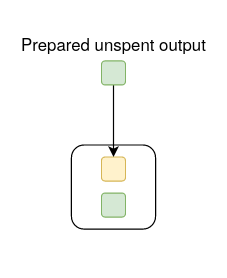

- `peace`

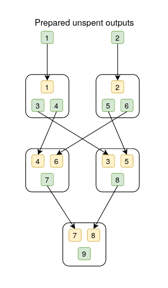

- `bb` - blow ball structure

##### Conflicts
- `ds`

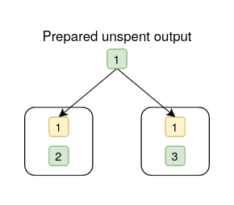

- `conflict-circle`

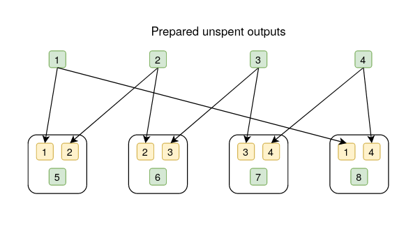

- `guava`

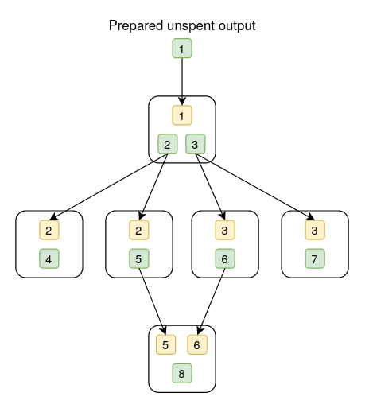

- `orange`

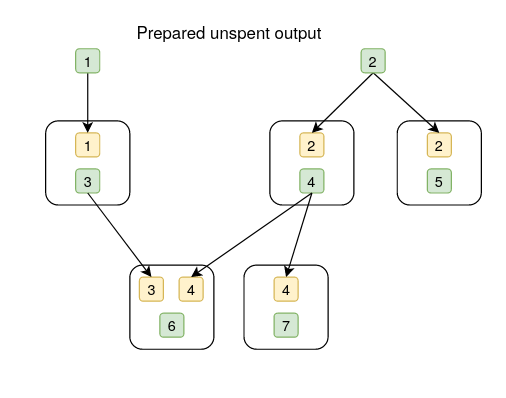

- `mango`

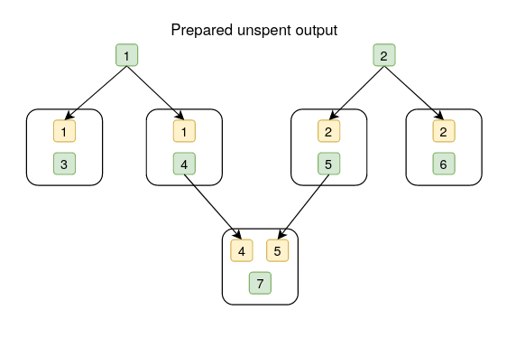

- `pear`

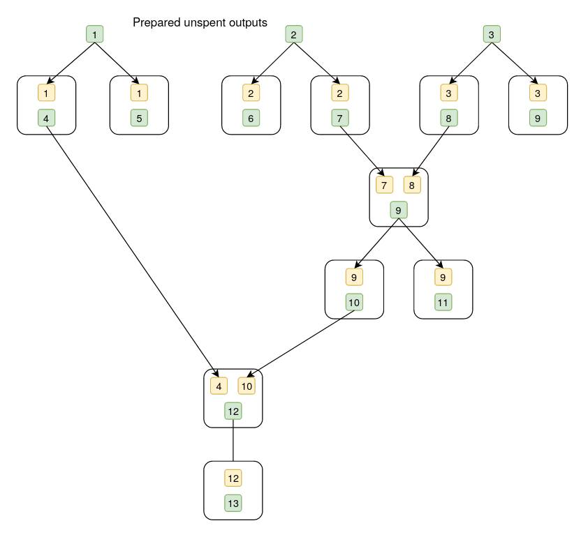

- `lemon`

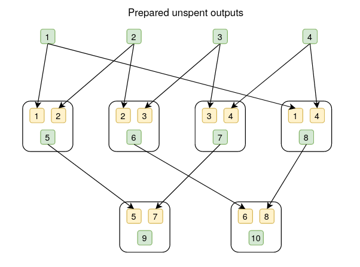

- `banana`

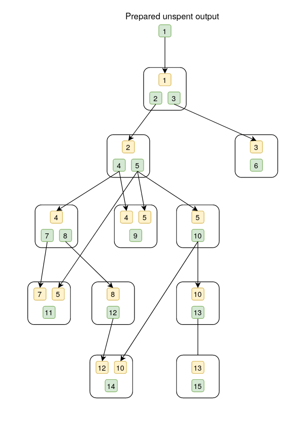

- `kiwi`

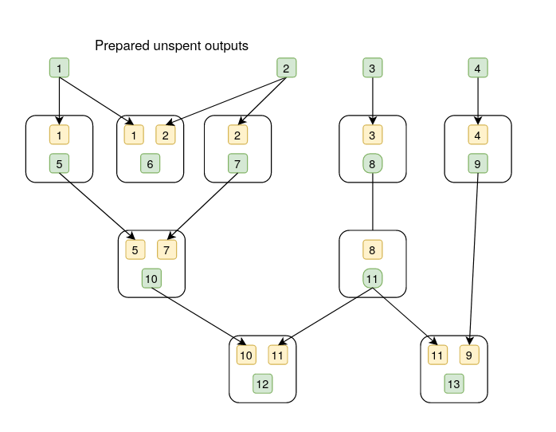


